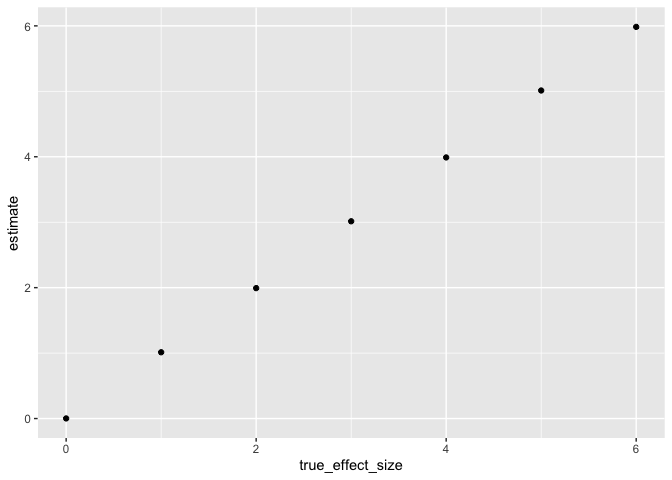

p8105_hw5_md4036
================
Margaret
2022-11-10

``` r
library(tidyverse)
```

    ## ── Attaching packages ─────────────────────────────────────── tidyverse 1.3.2 ──
    ## ✔ ggplot2 3.3.6      ✔ purrr   0.3.4 
    ## ✔ tibble  3.1.8      ✔ dplyr   1.0.10
    ## ✔ tidyr   1.2.0      ✔ stringr 1.4.1 
    ## ✔ readr   2.1.2      ✔ forcats 0.5.2 
    ## ── Conflicts ────────────────────────────────────────── tidyverse_conflicts() ──
    ## ✖ dplyr::filter() masks stats::filter()
    ## ✖ dplyr::lag()    masks stats::lag()

``` r
library(tidyr)
library(dplyr)
```

Problem 2

``` r
WashPost =
 read_csv(file = "./hw5data/homicide-data.csv") %>%
  janitor::clean_names()
```

    ## Rows: 52179 Columns: 12
    ## ── Column specification ────────────────────────────────────────────────────────
    ## Delimiter: ","
    ## chr (9): uid, victim_last, victim_first, victim_race, victim_age, victim_sex...
    ## dbl (3): reported_date, lat, lon
    ## 
    ## ℹ Use `spec()` to retrieve the full column specification for this data.
    ## ℹ Specify the column types or set `show_col_types = FALSE` to quiet this message.

``` r
view(sample_n(WashPost, 1000))
```

``` r
data_1 = 
  WashPost %>%
  janitor::clean_names() %>%
  unite(city_state, c(city, state), sep = ",") %>%
  unite(fullname, c(victim_last, victim_first), sep = " , ") %>%
  mutate(
    homicide_type= ifelse (disposition %in% c("Closed without arrest","Open/No arrest"), "1", "0"),
    homicide_type = recode(homicide_type, "1" = "unsolved", "0" = "solved"))%>%
  relocate(city_state)%>%
  filter(city_state != "Tulsa,AL")


view(sample_n(data_1, 1000))
```

The `WashPost` raw data shows a decade of homicide arrest data from 50
of the nation’s largest cities. This includes 52,000 criminal homicides.
The information that is given is the reported date, victim’s first and
last name, race, age, and sex. It also includes the city and state of
where it took place as well as the latitude and longitude. It also
includes a `disposition` vairable that indicates if it was open or
closed and no arrest or arrest. Both the victims first and last name
were combined to create a fullname variable. Additionally, `city` and
`state` were combined to create a `city_state` variable.

``` r
homicide_1 = 
  WashPost%>%
  group_by(city)%>%
  summarize (n_obs = n())

view (homicide_1)
```

``` r
homicide_2 = 
  data_1 %>%
  group_by(city_state, homicide_type) %>%
  summarize(n_obs = n()) %>%
  pivot_wider(
    names_from = homicide_type, 
    values_from = n_obs)%>%
mutate(total_homicides = solved + unsolved)%>%
select(city_state, unsolved, total_homicides)
```

    ## `summarise()` has grouped output by 'city_state'. You can override using the
    ## `.groups` argument.

``` r
view(homicide_2)
```

For the city of Baltimore, MD, use the prop.test function to estimate
the proportion of homicides that are unsolved; save the output of
prop.test as an R object, apply the broom::tidy to this object and pull
the estimated proportion and confidence intervals from the resulting
tidy dataframe.

Now run prop.test for each of the cities in your dataset, and extract
both the proportion of unsolved homicides and the confidence interval
for each. Do this within a “tidy” pipeline, making use of purrr::map,
purrr::map2, list columns and unnest as necessary to create a tidy
dataframe with estimated proportions and CIs for each city.

``` r
prop_test_fun = function(x){
  city_sum = x %>% 
    summarize(n_unsol = sum(homicide_type == "unsolved"),
              n = n())
  city_test = prop.test(x = pull(city_sum, n_unsol),
                         n = pull(city_sum, n))
  return(city_test)
}

data_2 = 
  data_1 %>%
  nest(data = uid:homicide_type) %>%
  mutate(city_res = map(data, prop_test_fun),
         test_res = map(city_res, broom::tidy)) %>% 
  select(city_state, test_res) %>% 
  unnest(test_res)

homicide_2 %>%
  filter(city_state == "Baltimore,MD")%>%
  pull (unsolved)
```

    ## [1] 1825

``` r
homicide_2 %>%
  filter(city_state == "Baltimore,MD")%>%
  pull(total_homicides)
```

    ## [1] 2827

``` r
proptest_unsolved =
    prop.test(
      x = homicide_2 %>%
  filter(city_state == "Baltimore,MD")%>%
  pull (unsolved),
      n = homicide_2 %>%
  filter(city_state == "Baltimore,MD")%>%
  pull(total_homicides),
      conf.level = 0.95,
      alternative = c("two.sided"),
      correct = TRUE) %>%
    broom::tidy() %>%
      select(estimate, conf.low, conf.high)
  
  proptest_unsolved
```

    ## # A tibble: 1 × 3
    ##   estimate conf.low conf.high
    ##      <dbl>    <dbl>     <dbl>
    ## 1    0.646    0.628     0.663

``` r
  data_2 %>% 
    mutate(city_state = fct_reorder(city_state, estimate)) %>% 
    ggplot(aes(x = city_state, y = estimate)) +
    geom_errorbar(aes(ymin = conf.low, ymax = conf.high)) + 
    theme(axis.text.x = element_text(angle = 90, hjust=1)) +
    labs(title = "...")
```

<!-- -->

# Problem 3

``` r
sim_fun = function(n, mu, sigma, ndata){
  res_sim = data.frame()
  for (s in 1:ndata){
    simulate_num = rnorm(n, mu, sigma)
    t_test_result = t.test(x = simulate_num, mu = 0) %>%
      broom::tidy() 
      res_sim [s, "num"] = s
      res_sim [ s, "mean"] = mean (simulate_num)
      res_sim [ s, "p-val"] = t_test_result %>% pull(p.value)
      
  }
  return(res_sim)
}

simulate_mu_0 = sim_fun(n = 30, mu = 0, sigma = 5, ndata = 5000)
mean_mu_0 = mean(simulate_mu_0[,2])
mean_mu_0_rej = mean(simulate_mu_0[simulate_mu_0[,3] < 0.05,2])
rej_mu_0 = sum(simulate_mu_0[,3]< 0.05)/5000


simulate_mu_1 = sim_fun(n = 30, mu = 1, sigma = 5, ndata = 5000)
mean_mu_1 = mean(simulate_mu_1[,2])
mean_mu_1_rej = mean(simulate_mu_1[simulate_mu_1[,3] < 0.05,2])
rej_mu_1 = sum(simulate_mu_1[,3]< 0.05)/5000

simulate_mu_2 = sim_fun(n = 30, mu = 2, sigma = 5, ndata = 5000)
mean_mu_2 = mean(simulate_mu_2[,2])
mean_mu_2_rej = mean(simulate_mu_2[simulate_mu_2[,3] < 0.05,2])
rej_mu_2 = sum(simulate_mu_2[,3]< 0.05)/5000


simulate_mu_3 = sim_fun(n = 30, mu = 3, sigma = 5, ndata = 5000)
mean_mu_3 = mean(simulate_mu_3[,2])
mean_mu_3_rej = mean(simulate_mu_3[simulate_mu_3[,3] < 0.05,2])
rej_mu_3 = sum(simulate_mu_3[,3]< 0.05)/5000

simulate_mu_4 = sim_fun(n = 30, mu = 4, sigma = 5, ndata = 5000)
mean_mu_4 = mean(simulate_mu_4[,2])
mean_mu_4_rej = mean(simulate_mu_4[simulate_mu_4[,3] < 0.05,2])
rej_mu_4 = sum(simulate_mu_4[,3]< 0.05)/5000

simulate_mu_5 = sim_fun(n = 30, mu = 5, sigma = 5, ndata = 5000)
mean_mu_5 = mean(simulate_mu_5[,2])
mean_mu_5_rej = mean(simulate_mu_5[simulate_mu_5[,3] < 0.05,2])
rej_mu_5 = sum(simulate_mu_5[,3]< 0.05)/5000

simulate_mu_6 = sim_fun(n = 30, mu = 6, sigma = 5, ndata = 5000)
mean_mu_6 = mean(simulate_mu_6[,2])
mean_mu_6_rej = mean(simulate_mu_6[simulate_mu_6[,3] < 0.05,2])
rej_mu_6 = sum(simulate_mu_6[,3]< 0.05)/5000

estimate = c(mean_mu_0,mean_mu_1,mean_mu_2,mean_mu_3,mean_mu_4,mean_mu_5,mean_mu_6)
power = c(rej_mu_0, rej_mu_1, rej_mu_2, rej_mu_3, rej_mu_4, rej_mu_5, rej_mu_6)
mu_hat_rej = c(mean_mu_0_rej,mean_mu_1_rej,mean_mu_2_rej,mean_mu_3_rej,mean_mu_4_rej,mean_mu_5_rej,mean_mu_6_rej)

true_effect_size = c(0,1,2,3,4,5,6)

mydata = data.frame(cbind(estimate, power, true_effect_size, mu_hat_rej))

ggplot(data = mydata, aes(x = true_effect_size, y = power)) +
  geom_point()
```

<!-- -->

``` r
ggplot(data = mydata, aes(x = true_effect_size, y = estimate)) +
  geom_point()
```

<!-- -->

``` r
ggplot(data = mydata, aes(x = true_effect_size, y = mu_hat_rej)) +
  geom_point() 
```

<!-- -->

The larger the effect size, the larger the power. This is seem fromm the
first curved graph between effect size and power.

The sample average of μ̂ across tests for which the null is rejected
approximately equal to the true value of μ because when plotted, there
is a linear relationship between average estimate of μ̂ only in samples
for which the null was rejected and the true value of μ.
